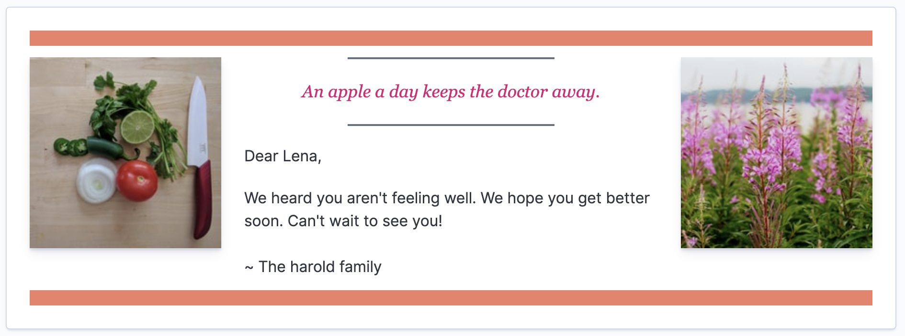
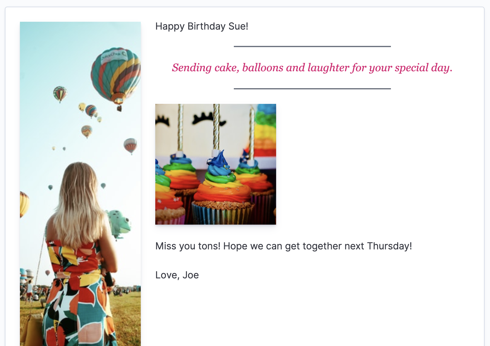

# Greeting card application v2

This plugin takes the basic example shown in [Greeting cards v1](../greeting_cards) and shows
how to create a more maintainable system, that scales as more greeting card types are added.

Instead of a bunch of "if" statements, this code will handle any type of newly registered
greeting cards. As a bonus, they can all be rendered differently.

Get well soon card:

Birthday card:

